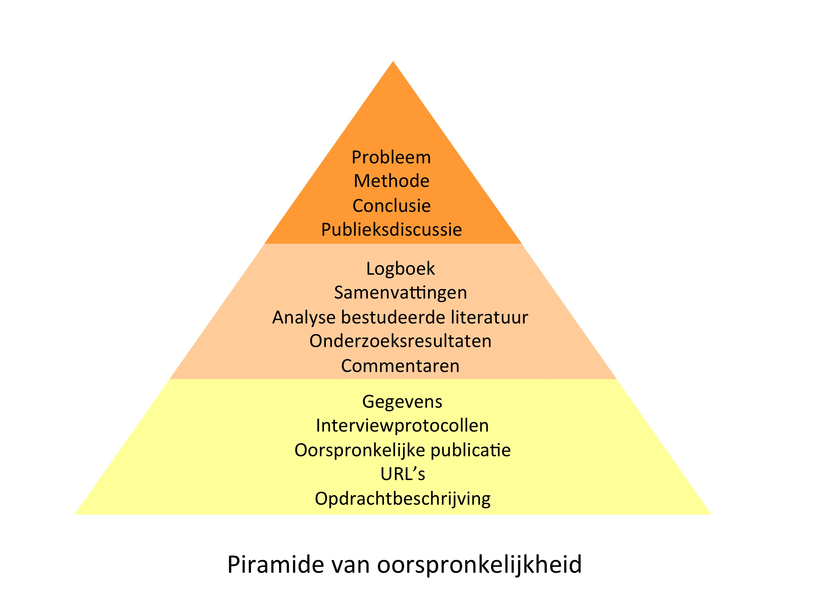

---
Pr-id: Open Publishing
P-id: PublishingLab article
A-id: 1
Type: article
Book-type: article
Anthology item: article
Item-id: 1
Article-title: Van praktijkgericht onderzoek naar de praktijk van de professional
Article-status: accepted
Author: Inte Gloerich
Author-email:   i.gloerich@hva.nl
Author-bio:  x
Abstract:   Hoe kan praktijkgericht onderzoek de professional beter bereiken?
Keywords:   praktijkgericht onderzoek, toegepast onderzoek, onderzoek, HBO, HvA, creatieve industrie
Rights: CC BY-NC 4.0
...

#VAN PRAKTIJKGERICHT ONDERZOEK NAAR DE PRAKTIJK VAN DE PROFESSIONAL

Door: Inte Gloerich, <i.gloerich@hva.nl>

Onder begeleiding van: Hilde van Wijngaarden

16 Februari 2016, [PublishingLab](http://www.publishinglab.nl/),
Hogeschool van Amsterdam

------

## Managementsamenvatting

De wereld van academisch publiceren is de afgelopen jaren onder invloed
van Open Access bezig met een vergaande reorganisatie. De eis van de
overheid dat onderzoeksresultaten voor iedereen toegankelijk zijn wordt
steeds sterker gehandhaafd, en publicatiemethodes passen zich hierop
aan. Tegelijkertijd heeft praktijkgericht onderzoek de afgelopen jaren
een centrale rol verworven in het hbo. Hoewel openheid hier ook van
belang is, blijkt uit dit onderzoek dat het Open Access systeem niet
goed op alle kenmerken van dit type onderzoek aansluit.

Naast een publiek van onderzoekers, hebben praktijkgerichte
onderzoeksresultaten ook een publiek van professionals. Zij kunnen de
opgedane kennis direct inzetten in hun organisaties en zo de
maatschappelijke impact van het onderzoek vergroten. Professionals
hebben echter andere doelen, behoeftes en werkwijzen dan onderzoekers,
en de publicatie van praktijkgerichte onderzoeksresultaten moet dit
reflecteren.

Het eerste verschil tussen onderzoekers en professionals is dat het geen
kerntaak van professionals is onderzoek te lezen. Dit betekent dat ze
geen toegang hebben tot veel journals, maar ook dat ze de weg naar
onderzoekspublicaties die wel open zijn niet goed weten te vinden.
Publiceren voor de professional betekent dat de netwerken en kanalen die
al bestaan in het werkveld ingezet moeten worden.

De tweede manier waarop professionals zich onderscheiden van
onderzoekers is de reden waarom ze nieuwe informatie zoeken.
Professionals geven aan niet veel tijd aan het lezen van onderzoek te
besteden en dit op de eerste plaats te doen om een concreet probleem uit
hun praktijk op te lossen. Dit betekent dat de informatie in een
publicatie gericht aan professionals uit moet gaan van de vragen van
professionals en relevante informatie helder en bondig moet presenteren.
Het onderzoeksrapport of artikel dient vervolgens als mogelijke
verdiepende informatie.

Tot slot is het voor professionals niet van belang waar een
onderzoeksproject begint of eindigt; ze willen een oplossing voor hun
probleem. Om onderzoeksresultaten beter te laten aansluiten op de
praktijk moeten ze dus gecombineerd worden en omgezet worden in
algemenere informatie.

Eén van de krachten van praktijkgericht onderzoek is de kans directe
maatschappelijke impact te hebben. Om deze kracht zo goed mogelijk tot
zijn recht te laten komen zal de publicatieondersteuning in hbo
instellingen ook hier concrete plannen voor moeten maken. Hoewel er
algemene oplossingen kunnen worden aangeboden, zal juist ook per sector
gekeken moeten worden hoe professionals zich hier organiseren.

### Aanbevelingen

Onderzoekspublicatie heeft ondersteuning vanuit de bibliotheek nodig om
ook de professional goed te bereiken. Hierbij moet rekening gehouden
worden met het volgende:

-   hoe kunnen netwerken die al bestaan in het werkveld bijdragen aan
    onderzoekspublicatie?

-   welke vragen heeft de professional, hoe kan de publicatie hierop
    inspelen?

-   professionals willen bondige, heldere informatie, die niet per se
    uit één onderzoeksproject hoeft te komen.

-   professionals zijn op zoek naar informatie, in plaats
    van onderzoeksresultaten. Hier is dus een vertaalslag nodig naar
    algemene, inzetbare kennis.

## Inhoud

## [Managementsamenvatting](#managmentsamenvatting)

### [Aanbevelingen](#_Toc315529322)

## [Inhoud](#_Toc316740854)

## [1. Inleiding](#ch01-00)

## [2. Praktijkgericht onderzoek in het HBO, en bij de HvA in het bijzonder](#_Toc311709031)

### [2.1 Het praktijkgericht onderzoek in Nederland](#_Toc311709032)

### [2.2 De situatie bij CREATE-IT en ACIN](#ch02-02)

### [2.3 Doelgroep en vorm van publicaties](#ch02-03)

### [2.4 Openheid van resultaten](#ch02-04)

### [2.5 Verschillen binnen onderzoek](#ch02-05)

## [3. Theoretisch kader: impact meten en openheid van resultaten](#ch03-00)

### [3.1 Toegankelijkheid van informatie, niet van onderzoeksresultaten](#ch03-01)

## [4. Empirisch onderzoek: de informatiebehoefte van de creatieve professional](#ch04-00)

### [4.1 Vindbaarheid](#ch04-01)

### [4.2 Inzetbaarheid](#ch04-02)

### [4.3 Consequenties voor publicatie](#ch04-03)

## [5. Conclusie](#ch05-00)

## [6. Bibliografie](#ch06-00)

## [7. Bijlages](#ch07-00)

### [7.1 Bijlage 1: Labs en Lectoraten van Create-IT en het ACIN](#ch07-01)

### [7.2 Bijlage 2: Uitkomsten enquête met onderzoekers](#ch07-02)

### [7.3 Bijlage 3: Uitkomsten enquete met event professionals](#ch07-03)

## 1. Inleiding

Dit rapport is het resultaat van onderzoek dat is uitgevoerd bij het
PublishingLab in samenwerking met de Bibliotheek UvA/HvA. Het
PublishingLab maakt deel uit van het kenniscentrum CREATE-IT van de
faculteit Digitale Media en Creatieve Industrie (DMCI) en het Amsterdam
Creative Industries Network (ACIN). CREATE-IT en ACIN faciliteren en
ondersteunen onderzoekers en onderzoeksprojecten op het gebied van de
creatieve industrie en digitale techniek. Hieronder wordt bijvoorbeeld
techniek in de mode-industrie, digitalisering in de uitgeefsector en
digitale oplossingen voor ontwerpvraagstukken verstaan.

Uit het onderzoek bij het onderzoek bij het kenniscentrum kwam de vraag
naar voren hoe multimediale onderzoeksresultaten gepubliceerd kunnen
worden zodat ze bijdragen aan de optimalisering van het werk in de
creatieve industrie. In eerste instantie leek vooral de multimedialiteit
een vraagstuk, maar gedurende het onderzoek bleek dat de inzetbaarheid
van het onderzoek in de praktijk de overkoepelende vraag was (hoewel er
ook een grote diversiteit aan media ingezet wordt). Daarnaast is
gebleken dat een aantal van de bevindingen van het onderzoek
voornamelijk binnen de creatieve industrie toepasbaar zijn, maar andere
juist een bredere inzetbaarheid hebben. De definitieve onderzoeksvraag
van dit rapport luidt daarom als volgt:

*Hoe moet er binnen praktijkgericht onderzoek gepubliceerd worden om een
bijdrage te leveren aan de praktijk?*

Deze onderzoeksvraag raakt aan een (relatief nieuwe) kerntaak van
hbo-instellingen: onderzoek doen. Dit onderzoek is in grote mate
praktijkgericht[^1], wat niet alleen inhoudelijk tot uiting komt, maar
ook het publiek van de uitkomsten bepaalt. Dat wil zeggen, het onderzoek
neemt de praktijk en praktische vragen als uitgangspunt en is juist
daarom ook interessant voor mensen die in deze praktijk werken. De
projecten komen vaak tot stand in samenwerking met bedrijven en dragen
bij aan de groei en ontwikkeling van een bepaalde beroepspraktijk
(Hogeschool van Amsterdam 27). Naast de geleverde bijdrage aan
onderwijs, professionalisering en kennisontwikkeling wordt
praktijkgericht onderzoek bij de HvA beoordeeld op de mate waarin het de
beroepspraktijk en maatschappij weet te bereiken (O2, 'Indicatoren' 3).

Behalve directe partners uit het bedrijfsleven zijn organisaties in de
bredere sectoren, zoals de creatieve industrie in het algemeen, niet op
de hoogte van het voor hen relevante onderzoek, of zoals de HBO-raad het
stelt: 'van een echte gedeelde *body of knowledge* met de
beroepspraktijk is nog onvoldoende sprake' (Terpstra en Van der Vos 6).
Sites als de HBO-Kennisbank zijn nog onvoldoende bekend bij
professionals die deze resultaten in hun praktijk kunnen inzetten.
Daarnaast is de vorm waarin informatie te vinden is op dergelijke sites
niet toegespitst op gebruik door professionals. Terwijl onderzoek onder
andere gewogen wordt aan de hand van maatschappelijke impact, is de
juiste manier om deze impact inzichtelijk te maken nog niet gevonden.

Aan de hand van de volgende deelvragen wordt onderzocht hoe de impact
van onderzoek op de beroepspraktijk geoptimaliseerd kan worden:

1.  Hoe kenmerkt de relatie van CREATE-IT / ACIN onderzoekers en de
    praktijk zich nu?

2.  Welke rol spelen openheid en Open Access in het bereiken van de
    professional?

3.  Wat voor informatiebehoefte heeft de creatieve professional?

4.  Hoe kan impact op de beroepspraktijk gemeten worden?

Om antwoord te geven op deze vragen is in eerste instantie door
literatuuronderzoek over onderzoekspublicatie een beeld geschetst van de
huidige situatie in algemene zin. Vervolgens is via de raadpleging van
jaarverslagen en andere documenten van de HvA en bijvoorbeeld de
Vereniging van Hogescholen ingezoomd op praktijkgericht onderzoek en de
publicatiestrategieën die hier gebruikt worden. Als aanvulling hierop is
gesproken met diverse onderzoekers van CREATE-IT en ACIN over hoe zij de
publicatie van hun onderzoek aanpakken. Er is onder hen ook een enquête
afgenomen over de resultaten van hun onderzoek en aan wie dit ten goede
komt. Tot slot is er een enquête afgenomen bij festivalprofessionals,
als directe doelgroep van één van de behandelde onderzoeksgroepen. Deze
enquête was voornamelijk gericht op de informatiebehoefte en -consumptie
van de professionals.

## 2. Praktijkgericht onderzoek in het HBO, en bij de HvA in het bijzonder

### 2.1 Het praktijkgericht onderzoek in Nederland

Onderzoek bij hogescholen is 'geworteld in de beroepspraktijk'
(Vereniging Hogescholen). De relatie tussen praktijkgericht onderzoek en
bedrijven wordt door de overheid gestimuleerd via het Nationaal
Regieorgaan Praktijkgericht Onderzoek (SIA). De RAAK-mkb regeling[^2]
van SIA geeft via richtlijnen aan hoe de relatie tussen onderzoek en het
vakgebied ingevuld zou moeten worden om in aanmerking te komen voor een
subsidie. SIA stelt dat projecten die in aanmerking komen 'een onder het
professionele werkveld van het mkb breed herkend en aanwijsbaar probleem
of een kans op verbetering' als aanleiding nemen; dat het 'resultaat van
het onderzoek \[...\] praktisch toepasbare kennis voor de
beroepspraktijk \[is\]'; en dat 'onderzoeksresultaten tot stand gekomen
met RAAK-subsidie \[...\] zo veel en zo spoedig mogelijk voor het
publiek en voor verder onderzoek toegankelijk \[dienen\] te zijn' (3,
6-7). Hoewel een minderheid van het hbo-onderzoek via de RAAK-regeling
gefinancierd wordt, geldt de regeling als een goede beschrijving van de
karakteristieken van de praktijkgerichte focus van dit onderzoek. Zo kan
die hier dienen als een ijkpunt voor de relatie tussen onderzoek en
praktijk.

### 2.2 De situatie bij CREATE-IT en ACIN

Het kenniscentrum van DMCI van de Hogeschool van Amsterdam bestaat uit
lectoraten en labs[^3] die onderzoek verrichten met betrekking tot 'de
invloed van digitale media en technologie op de maatschappij en de stad'
waarbij samengewerkt wordt met de 'creatieve industrie, IT en de
publieke sector in de regio Amsterdam' (CREATE-IT).[^4] Sommige
lectoraten, zoals Netwerkcultuur en Digital Life bestaan al meer dan
tien jaar, terwijl veel van de labs, met uitzondering van het MediaLAB,
in 2014 of 2015 tot stand zijn gekomen. Er bestaat mede hierdoor een
groot verschil tussen de hoeveelheid ervaring met publiceren tussen de
verschillende onderzoeksgroepen.

De onderzoeksgroepen[^5] werken met partners uit het veld, maar de
constructie van die samenwerking verschilt per onderzoeksgroep, zo
blijkt uit de enquête. Sommige werken met contractresearch waarbij de
resultaten voornamelijk voor de opdrachtgever bedoeld zijn. Anderen
werken in projecten waarbij in een consortium intensief met partners
samengewerkt wordt aan een project.[^6] In bijvoorbeeld het MediaLAB
wordt gewerkt met een partnerbedrijf dat een vraag voorlegt aan een team
van stagiair(e)s die hier vervolgens een semester ontwerponderzoek voor
doet. Dan zijn er nog promotietrajecten die een probleem dat in de
praktijk bestaat vanuit een meer fundamenteel perspectief benaderen in
een meerjarig traject.[^7]

### 2.3 Doelgroep en vorm van publicaties

De verschillende relaties van de onderzoeksprojecten met de praktijk
zorgen er ook voor dat er veel verschillende manieren van publiceren
bestaan. Zo geven evenveel onderzoekers in de enquête aan te schrijven
voor een public van professionals als een publiek van onderzoekers.
Naast de meer traditionele wetenschappelijke publicaties en conferenties
houden onderzoekers blogs en social media bij en richten zij eigen sites
in.[^8] De meer technische georiënteerde onderzoeksgroepen gebruiken
GitHub[^9] om code te archiveren en open te publiceren en anderen lukt
het om in populaire media zoals Trouw, Amsterdam FM of de NOS te komen.
Ook delen onderzoekers hun onderzoek en opgedane kennis in
kennistransferavonden, meet-ups en workshops met een publiek van
professionals.[^10]

*De antwoorden op één van de vragen die in de enquête aan onderzoekers gesteld zijn.*

### 2.4 Openheid van resultaten

Openbare publicatie van onderzoek komt toepassing in de maatschappij ten
goede, maar niet alle onderzoeken lenen zich hiervoor. Het komt
bijvoorbeeld voor dat resultaten uit contractresearch in verband met
concurrentiegevoelige informatie niet openlijk mogen worden gedeeld. Ook
voor de onderzoeker zelf speelt voorzichtigheid met openheid soms een
rol: publiceren in toonaangevende journals is immers een aspect waarop
onderzoekers worden beoordeeld en ideeën openlijk delen voordat dit is
gebeurd kan zo’n publicatie in de weg staan (Nentwich and König 117).
Bij Create-IT en ACIN geven onderzoekers echter wel aan dat een
overgrote meerderheid van de projecten resultaten oplevert die open
gedeeld kunnen worden en zo ten dienste komen te staan van de gehele
sector.[^11] Wanneer onderzoeksresultaten vrij toegankelijk zijn
bespoedigt dit de inzet in de praktijk: ze kunnen gedeeld worden op
verschillende platformen en de eigen situatie van de professional kan
makkelijk vergeleken worden met de situatie waarop het onderzoek
gebaseerd is. De hedendaagse werknemer, gewend aan Google en Wikipedia,
gaat er zelfs min of meer van uit dat informatie vrijelijk gedeeld kan
worden (Terpstra en Van der Vos 7). Meer over de consequenties hiervan
en de specifieke invulling van open publiceren komt aan bod in het
volgende hoofdstuk.

### 2.5 Verschillen binnen onderzoek

Zoals hiervoor bleek, bestaan er veel verschillen binnen praktijkgericht
onderzoek. Deze verschillen zorgen ervoor dat er geen
*one-size-fits-all* oplossing is voor publicatie ten behoeve van die
praktijk. De diversiteit zal juist gefaciliteerd moeten worden om de
verschillende sectoren optimaal te dienen. Hieronder een overzicht van
de verschillende kenmerken van praktijkgericht onderzoek die zojuist
behandeld zijn:

**Verschillen in toegepast onderzoek**

  Item                      Van                 Tot
  ------------------------- ------------------- ------------------------------- 
  Toon van publicaties      Fundamenteel        Toegepast
  Relatie tot bedrijfsleven In opdracht van     In samenwerking met
  Voornaamste publiek       Onderzoekers        Professionals
  Toegankelijkheid          Gesloten            Open
  Vorm                      Tekst               Multimediaal

## 3. Theoretisch kader: impact meten en openheid van resultaten

Wetenschappelijke impact wordt vaak gemeten aan de hand van
bibliometrische gegevens zoals de impactfactor.[^12] Sinds de opkomst
van het internet hebben social media, wikis en blogs
onderzoekspublicaties een nieuwe impuls gegeven die nog niet goed
herkend wordt in de berekening van wetenschappelijke impact (Puschmann
102). Altmetrics, een alternatieve manier van impactmeting die
bijvoorbeeld bereik op (academische) social media, referentiemanagers
als Zotero, Wikipedia en blogs meeneemt in de berekening van impact,
worden hierdoor steeds relevanter (Priem, Groth en Taraborelli).
Altmetrics is in academische zin een interessant alternatief voor
traditionele impactberekeningen van journalartikelen, en juist omdat er
ook plaats is voor diverse soorten resultaten én impact kan het voor
praktijkgericht onderzoek ook een uitkomst bieden.

Toegepast onderzoek heeft bij uitstek een maatschappelijke impact,
‘artefacten, methoden, oplossingen voor maatschappelijke problemen en
het creëren van economische kansen zijn daarom soms belangrijkere
resultaten \[...\] dan publicaties voor vakgenoten’ (De Jonge Akademie
24-25). Toegepast onderzoek kan bijvoorbeeld een middel zijn om
academische kennis met een wetenschappelijke impact, om te zetten in een
praktische innovatie. Deze maatschappelijke impact wordt sterk bevorderd
door openheid, waardoor samenwerking tussen verschillende partijen
mogelijk wordt en kennis hergebruikt en opnieuw gecontextualiseerd kan
worden (van Vliet 21-22). Deze impact is echter moeilijker
kwantificeerbaar dan wetenschappelijke impact ‘omdat dat belang een
normatieve waardering is die afhangt van \[de\] maatschappij en
individuen’ (De Jonge Akademie 25; zie ook: Landelijke Commissie
Valorisatie 13). De publicatiemiddelen die Puschmann noemt, zoals
Twitter, academische social media als ResearchGate en blogsites, hebben
juist potentie om beter met professionals in het veld te communiceren
dan journals dat kunnen. Zoals hierboven al benoemd, worden (sommige
van) deze media namelijk daadwerkelijk ingezet door de onderzoeksgroepen
van CREATE-IT en ACIN.

De HvA heeft zelf indicatoren voor praktijkgericht onderzoek vastgesteld
op basis waarvan over het onderzoek gerapporteerd wordt. Deze
indicatoren geven inzicht in de producten van het onderzoek en het
gebruik en erkenning hiervan. De productindicatoren zijn opgedeeld aan
de hand van het doel dat ze dienen: beroepspraktijk en maatschappij,
onderwijs en professionalisering, en kennisontwikkeling (O2 3-5). De
indicatoren voor de beroepspraktijk en maatschappij zijn hieronder
overgenomen. Wat opvalt, is dat sociale media, websites, blogs en andere
digitale middelen niet aanwezig zijn in het overzicht. Verder bestaan er
voor de beschrijving van het gebruik van de producten geen duidelijke
richtlijnen. Dit reflecteert de moeilijkheid maatschappelijke impact te
meten zoals hierboven is aangehaald.

**Overzicht HvA Indicatoren voor praktijkgericht onderzoek en streefwaarden**
  
  Doelstelling                                                                    Indicator               Definitie
  ------------------------------------------------------------------------------- ----------------------- --------------------------------------------------------------------------------------------------------------------
  Beroepspraktijk en Maatschappij                                                 Producten               Vak/professionele publicaties
                                                                                                          Populariserende publicaties
                                                                                                          Andere producten
                                                                                  Gebruik van producten   Kwalitatieve beschrijving van daadwerkelijk gebruik door de beroepspraktijk/ maatschappij van onderzoeksresultaten
                                                                                  Erkenning               Derdegeldstroom gefinancierde projecten
                                                                                                          Media-uitingen	

*Uitsnede uit de tabel op pagina 3-5 van Format en Toelichting bij de HvA Indicatoren voor Praktijkgericht Onderzoek (O2)*

Eppo Bruins benadrukt in het rapport ‘Waardeloos’ van de Landelijke
Commissie Valorisatie[^13] dat indicatoren een manier zijn om de
werkelijkheid inzichtelijk te maken, maar dat ze geen vervanging voor
deze werkelijkheid zijn, waarmee hij aangeeft dat dit uiteindelijke
doel, impact in de maatschappij, niet uit het oog verloren moet worden.
In het rapport werkt de commissie verder uit hoe indicatoren dan wel
effectief ingezet kunnen worden. Ze raden aan voor elke discipline eigen
indicatoren te gebruiken en meer dan alleen kwantitatieve indicatoren te
gebruiken (8, 11-12, 14). Uit eigen onderzoeksprojecten van de hbo
Kennisbank komt naar voren dat ook de ontsluiting van informatie moet
worden afgesteld op de discipline (Van de Wijngaart 27). Een voorbeeld
is het project Landelijk Kennisplein Verslavingszorg, dat de gebruiker
door middel van tien verschillende filters verschillende wegen door de
informatie bood (Bierens en Van den Bergh 14).

### 3.1 Toegankelijkheid van informatie, niet van onderzoeksresultaten

In de academische wereld is de gang richting Open Access publiceren
sinds 2000 steeds sterker ingezet. Het beleid van het Ministerie van OCW
is erop gericht dat in plaats van te betalen voor toegang tot
publicaties, universiteiten juist gaan betalen voor de publicatie van de
artikelen van hun onderzoekers. Een belangrijke consequentie hiervan is
dat deze publicaties open toegankelijk zijn voor iedereen (Snijders; Aan
de Brugh). Lectoren en andere onderzoekers zijn (nog) niet eenduidig
positief over Open Access, bijvoorbeeld omdat er nog niet voor alle
vakgebieden Open Access journals met voldoende aanzien bestaan
(Vereniging Hogescholen; bijlage 2). Open Access is desalniettemin
inmiddels ook op hogescholen een belangrijk aandachtspunt.[^14] De
overheid stelt duidelijk dat 'met publiek geld gefinancierd onderzoek
\[...\] voor iedereen, overal ter wereld, toegankelijk \[moet\] zijn'
(Ministerie van OCW), en stimuleert dit bijvoorbeeld via de
RAAK-regeling. Deze openheid is een voorwaarde om ervoor te kunnen
zorgen dat onderzoeksresultaten buiten de onderzoekssfeer kunnen treden
en ingezet kunnen worden door professionals. Open Access wordt over het
algemeen gezien als een belangrijke manier om deze maatschappelijke
impact te bevorderen.

Het zou mooi zijn als Open Access - een van oorsprong *academische*
oplossing voor een *academisch* probleem[^15] - ook een-op-een
toepasbaar is op toegepast onderzoek. Waar het gaat om publicaties die
gericht zijn op andere onderzoekers zal dit in grote mate ook zo zijn.
Maar 'helaas, veel wetenschappelijke informatie is, ook als het vrij
beschikbaar is, nog niet geschikt voor direct (her)gebruik bij innovatie
en toepassing' (Terpstra en Van der Vos 7). Open Access is dus geen
oplossing voor de vraag die aan dit onderzoek ten grondslag ligt: hoe
moet er binnen praktijkgericht onderzoek gepubliceerd worden om een
bijdrage te leveren aan de praktijk? Hoewel het Open Access-systeem de
publicaties in theorie toegankelijk maakt voor iedereen, zorgt het er
niet voor dat relevante informatie vindbaar en inzetbaar is voor de
professional.[^16] Open Access publiceren wordt in het strategisch
onderzoeksbeleid van de HvA genoemd wordt onder de doelstelling om bij
te dragen aan de beroepspraktijk en maatschappij (O2 38). Dit is een
voorbeeld van de manier waarop Open Access gezien wordt als een
oplossing voor een probleem dat in werkelijkheid ergens anders om
draait. Waar dit probleem precies zit wordt in het volgende hoofdstuk
duidelijk.

## 4. Empirisch onderzoek: de informatiebehoefte van de creatieve professional

Nu ook maatschappelijke impact een steeds belangrijkere graadmeter wordt
in het onderzoek, is het tijd een publicatiemodel te ontwikkelen dat
naast het model voor wetenschappelijke impact bestaat. Dit nieuwe model
zal als specifiek moeten hebben doel maatschappelijke impact te
faciliteren. De dagelijkse werkzaamheden van een onderzoeker en een
professional verschillen nogal en dit heeft invloed op hoe zij
interacteren met onderzoeksresultaten. Dit heeft consequenties voor de
manier waarop de onderzoeksresultaten idealiter gepubliceerd en
gepresenteerd worden. Om deze consequenties in kaart te brengen is
gesproken met professionals in de creatieve industrie. Er is hierbij als
casus gekozen voor festivalprofessionals, die bediend worden door het
Event Lab van ACIN. Hieronder wordt aan de hand van de bevindingen van
de gesprekken met festivalprofessionals beschreven hoe vindbaarheid en
inzetbaarheid ingevuld kunnen worden om het gebruik van
onderzoeksresultaten door deze professionals te faciliteren.

### 4.1 Vindbaarheid

Professionals in deze sector komen niet vaak in aanraking met onderzoek
dat voor hen relevant is. Zo zijn ze grotendeels onbekend met
academische journals, de HBO-Kennisbank,[^17] institutionele
*repositories* en sites als die van de onderzoeksgroepen zelf.[^18] Ook
al maakt Open Access publiceren de artikelen toegankelijk, de
professional maakt gebruik van dusdanig andere informatiekanalen dat
deze hem of haar hierdoor niet of nauwelijks beter zullen bereiken.

Dit betekent dat er, om de resultaten terecht te laten komen bij de
creatieve industrie waarvoor ze bedoeld zijn, geluisterd moet worden
naar de professional en onderzocht moet worden waar deze zoekt naar
informatie. Professionals die geïnterviewd zijn voor dit onderzoek geven
aan vooral via social media en bijvoorbeeld nieuwsbrieven op de hoogte
te blijven van hun vakgebied. Hierbij luisteren ze het meest naar
directe collega's en hun eigen (digitale) netwerk. Ze geven daarbij ook
aan dat brancheverenigingen interessante informatie aandienen via hun
website of in een vakblad. Ook fysieke ontmoetingen, zoals
netwerkevenementen en meet-ups worden op prijs gesteld als momenten van
kennisuitwisseling. Voor een optimale disseminatie en impact in de
maatschappij is het van belang een actieve relatie tot het werkveld te
onderhouden en het onderzoek toegankelijk te maken op plekken waar de
professional is, zoals die hier genoemd worden.

### 4.2 Inzetbaarheid

Traditionele onderzoeksoutput, zoals een artikel in een journal, is niet
de gewenste vorm van het professionele publiek.[^19] Zij zijn het lezen
van onderzoekartikelen of -rapportages niet gewend. Daarbij sluit deze
vorm niet aan bij de reden waarom professionals informatie opzoeken,
namelijk het oplossen van concrete problemen. Waar het lezen van
artikelen en andere onderzoeksoutput tot de kerntaken van een
onderzoeker behoren, staat dit voor een professional in dienst van het
functioneren van de organisatie. Slechts wanneer er zich een probleem
voordoet, of er het vermoeden is dat iets bijvoorbeeld efficiënter of
vernieuwender gemaakt kan worden, zal de professional over het algemeen
op zoek gaan naar informatie om hem/haar hierin de weg te leiden.

In plaats van de traditionele opbouw van een artikel of een rapport
geven professionals de voorkeur aan een digitale verwerking van het
onderzoek die toegespitst is op de vertaling naar de praktische inzet
van de informatie. Ze lezen het liefst een korte samenvatting met
eventueel voorbeelden uit de praktijk, links en beeldmateriaal, maar
houden graag toegang tot de meer uitgebreide publicatie, voor het geval
ze specifieke informatie nodig hebben. Het onderzoeksresultaat moet
daarnaast niet op zichzelf staand aangeboden worden, maar juist in een
bredere context. De professionals willen de informatie graag makkelijk
kunnen delen met collega’s en worden graag doorverwezen naar aanverwante
informatie. Idealiter zijn de organisaties die de uitkomsten al inzetten
inzichtelijk, evenals bijvoorbeeld de praktische consequenties en nieuwe
kosten of besparingen die uit de inzet voortkomen. De specifieke focus
van een onderzoeksproject is hier van minder belang dan toegang tot een
meer complete verzameling van informatie over een thema (mogelijkerwijs
voortkomend uit meerdere onderzoeken): het gaat om *informatie* op basis
van onderzoeksresultaten, niet om de onderzoeksresultaten zelf.

### 4.3 Consequenties voor publicatie

Dit betekent dat de onderzoeker bij de communicatie van zijn of haar
bevindingen rekening moet houden met verschillende soorten lezers (Hall
273), in dit geval onderzoekers en professionals. De doelstelling een
maatschappelijke impact te hebben met het toegepaste onderzoek van de
HvA brengt op deze manier met zich mee dat er nieuwe methodes van
ontsluiting toegevoegd moeten worden aan de al bestaande methodes.
Openheid zal daarbij een gegeven moeten zijn, in plaats van strikt
genomen Open Access.[^20] Deze openheid houdt in dat gepubliceerde
onderzoeksresultaten voor iedereen toegankelijk zijn, of dit nu via
journals gaat of via blogs, vakbladen of populaire media. Op deze manier
kan de publicatie van onderzoeksresultaten veel breder getrokken worden
dan mogelijk is via de traditionele kanalen. In plaats van slechts te
publiceren in boeken of journals en te presenteren op conferenties kan
de waarde van praktijkgericht onderzoek via bijvoorbeeld code op GitHub
en een actief netwerk met professionals herkend worden. De onderzoeker
zoekt de manieren van communicatie die al bestaan tussen professionals
op in plaats van ze te moeten bereiken met kanalen die niet op hen
gericht zijn.

Ook vanuit het praktijkgericht onderzoek zelf bekeken zijn journals lang
niet altijd een logische stap voor publicatie. Zeker binnen CREATE-IT en
ACIN, waar de focus op de creatieve industrie ligt, komen
onderzoeksresultaten in andere dan tekstuele vorm regelmatig voor. De
E-Scape Game van Harry van Vliet en Bernadette Schrandt van lectoraat
Crossmedia,[^21] gericht op onder andere museumprofessionals, is hier
een goed voorbeeld van. Hier kan een artikel over geschreven worden,
maar effectiever is het spel *an sich* toegankelijk en speelbaar te
maken. Andere voorbeelden van niet-tekstuele output zijn bijvoorbeeld
tools, code en prototypes zoals het Citizen Data Lab en het MediaLAB ze
ontwikkelen.

Wat betreft de vorm van de informatie komt het vanzelf
pas te denken in verschillende lagen, zoals op Surf Space[^22] door
gastcolumnist Herman van den Bosch beargumenteerd is. Hij geeft aan dat
voor lezers die nieuwe kennis praktisch willen inzetten traditionele
publicaties te begrensd zijn. Wanneer meerdere onderzoeksuitkomsten
gecombineerd worden, bijvoorbeeld die van een onderzoeksgroep, zal ook
de praktische inzetbaarheid vergroten. In plaats van deze veelheid aan
informatie non-hiërarchisch te presenteren pleit Van den Bosch voor
verschillende lagen van diepgang. In de meest oppervlakkige laag komt de
gebruiker met het probleem, de methode en de conclusie in aanraking en
kan hij/zij daarbij de discussie aangaan met anderen. Alleen wanneer de
gebruiker daadwerkelijk geïnteresseerd is kan deze op eigen initiatief
doorklikken naar diepere, meer genuanceerde lagen (Van den Bosch).

*Gelaagde publicatie zoals voorgesteld door Herman van den Bosch. Bron
van figuur: Van den Bosch, 2015.*

Zoals de professionals aangeven hoeft de traditionele vorm van
onderzoekspublicaties niet te verdwijnen. Het wordt zelfs op prijs
gesteld als het onderzoeksrapport of artikel toegankelijk is gemaakt.
Het gaat er echter om dat dit niet de toegangspoort moet zijn tot de
informatie; die moet opnieuw vormgegeven worden aan de hand van de
voorkeuren van de professionals. Hierbij moet rekening gehouden worden
met de soort informatie (tweets, links, video’s, grafieken, tekst,
etc.), en hoe de professional bij deze informatie terecht komt. De
informatie moet geherstructureerd worden zodat er meer overeenstemming
is met de wensen van de professional.

## 5. Conclusie

Praktijkgericht onderzoek
verschilt van academisch onderzoek: het staat dicht bij praktische
innovaties in het bedrijfsleven en levert resultaten op die hier direct
aan kunnen bijdragen. Dit is een kracht die nog niet optimaal tot z’n
recht komt in de disseminatie van de resultaten. Maatschappelijke impact
wordt groter op het moment dat onderzoekers inspelen op de werkwijze van
professionals en, naast meer traditionele onderzoekspublicaties, ook
structureel een relatie aangaan met de beroepspraktijk door middel van
praktijkgerichte publicatiestrategieën en het opzoeken van
uitwisselingsmomenten met professionals. Dit betekent dat samengewerkt
moet worden met instanties die door professionals gerespecteerd worden,
zoals vakbladen en brancheverenigingen in plaats van traditionele
onderzoekskanalen te volgen. Idealiter ontstaat daar hecht contact uit
tussen de professional en de onderzoeker, waardoor de maatschappelijke
impact van praktijkgericht onderzoek wordt vergroot.

Het beleid van de HvA met betrekking tot publicatieondersteuning en
beoordeling van onderzoekers sluit nog niet goed aan op de manier waarop
het bedrijfsleven bereikt kan worden. Dit beleid zal daarom uitgebreid
moeten worden. Het moet herkennen dat de maatschappelijke impact die
praktijkgericht onderzoek heeft, niet te meten is met traditionele
indicatoren en zal nieuwe publicatievormen en andere manieren van
informatie-uitwisseling op waarde moeten schatten, zonder dat dit per se
in cijfers te meten is. Daarbij moet het belang van een publicatie meer
afhangen van hoe centraal deze is voor innovatie in de praktijk dan hoe
vaak deze geciteerd wordt.

## 6. Bibliografie

Aan de Brugh, Marcel. “[De Chaos van Open Access.](http://www.nrc.nl/handelsblad/2015/01/10/de-chaos-van-open-access-1454804)” *NRC.* NRC Media, 10 Januari 2015. Web. 19 Oktober 2015.

Bierens, Gerard en Desirée van den Bergh. "HBO Kennisbank, Onmisbare
Schakel 2.0." In: *Stromen van Kennis Tussen Hogescholen en Praktijk.*
SURFfoundation: Utrecht, 2011.

Bruins, Eppo. "Uitgeteld." In: Waardevol. Indicatoren voor
Valorisatie. Landelijke Commissie Valorisatie. Utrecht, 2011.

CREATE-IT. "Achtergrond." *Hogeschool van Amsterdam.* 15 Oktober 2015.
Web. 2 December 2015.

Hahn, Karla, Charles Lowry, Clifford Lynch and David Shulenberger.
"The University's Role in the Dissemination of Research and
Scholarship - A Call to Action." *Association of Research Libraries.*
Washington, 2009.

Hall, Ralph. *Applied Social Research. Planning, Designing and
Conducting Real-World Research.* Melbourne, Macmillan Education AU,
2008.

Hogeschool van Amsterdam. "Jaarverslag 2014." *Hogeschool van
Amsterdam.* 24 Juni 2015.

Jonge Akademie, De. *Kennis over Publiceren.* Ed. Jeroen Salman,
Maarten Kleinhans en Dolf Weijers, 2012.

Kremers, Gonny, Alice Doek, Saskia Franken en Just de Leeuwe. "[Wat is
Open Access.](http://www.openaccess.nl/nl/wat-is-open-access)" *Open Access.nl.* Web. 9 December 2015.

Landelijke Commissie Valorisatie. *Waardevol. Indicatoren voor
Valorisatie.* Rathenau Instituut: Den Haag en Technologiestichting
STW: Utrecht, 2011.

Ministerie van Onderwijs, Cultuur en Wetenschap. "[Kabinetsplannen
Wetenschap 2015-2025.](https://www.rijksoverheid.nl/onderwerpen/wetenschap/inhoud/kabinetsplannen-wetenschap-2015-2025)" *Rijksoverheid.* Web. 13 December 2015.

Nationaal Regieorgaan Praktijkgericht Onderzoek SIA. "Call for
Proposals. RAAK-mkb." *Nationaal Regieorgaan Praktijkgericht Onderzoek
SIA.* Juli 2015.

Nentwich, Michael, and René König. "Academia Goes Facebook? The
Potential of Social Network Sites in the Scholarly Realm." *Opening
Science*. Ed. Sönke Bartling and Sascha Friesike. New York: Springer
International, 2014. p. 107-124.

Onderwijs en Onderzoek /O2. "Format en Toelichting bij de HvA
Indicatoren voor Praktijkgericht Onderzoek. Jaarverslag 2014."
*Hogeschool van Amsterdam.* 2015.

---. "Strategisch Onderzoeksbeleid 2015-2020." *Hogeschool van
Amsterdam.* 2015

Priem, Jason, Paul Groth and Dario Taraborelli. "The Altmetrics
Collection." *PLos ONE* 7(11), 2012.

Puschman, Cornelius. “(Micro)Blogging Science? Notes on Potentials and
Constraints of New Forms of Scholarly Communication.” *Opening
Science.* Ed. Sönke Bartling and Sascha Friesike. New York: Springer
International, 2014. p. 89-106.

Snijders, Raymond. “[Over Big Deals, Open Access en de onderhandelingen
tussen Elsevier en de universiteiten.](http://rsnijders.info/vakblog/2014/11/04/big-deals-open-access-elsevier/)” *Vakblog. Werken met
Informatie.* Wordpress, 04 November 2014. Web. 19 Oktober 2015.

SURFfoundation. “[Kennis van én voor de praktijk.](https://www.surf.nl/binaries/content/assets/surf/nl/kennisbank/2010/Kennis+van+en+voor+de+praktijk_artikelAad_SHAREprojecten_DEF.pdf)” *Surf Kennisbank.*
10 Augustus 2010. Web. 20 Oktober 2015.

Terpstra, Doekle en Johannes van der Vos. "Open Access in het HBO: 'OA
Modus 2.0'?" In: *Stromen van Kennis Tussen Hogescholen en Praktijk.*
SURFfoundation: Utrecht, 2011.

Van den Bosch, Herman. “[Weg met de Publicatie.](https://www.surfspace.nl/column/109-weg-met-de-publicatie/)” *SURF Space.* SURF, 15
Februari 2015. Web. 20 Oktober 2015.

Van de Wijngaart, Aad. "Kennis van én voor de Praktijk." In: *Stromen
van Kennis Tussen Hogescholen en Praktijk.* SURFfoundation: Utrecht,
2011.

Van Vliet, Harry. “Lectoraten als *third spaces*.” *HO Management*.
Issue: December (2011): p. 20-23.

Verbruggen, Erwin, Johan Oomen en Eggo Müller. “Bringing Europe’s
Audiovisual Heritage Online: EUScreenXL.” *IASA Journal.* Issue: no.
42 (January 2014): p. 54-60.

Vereniging Hogescholen. "Brancheprotocol Kwaliteitszorg Onderzoek
(BKO) 2009-2015." *Vereniging Hogescholen.* Oktober 2007.

Wolters, Pia en Lianne van Elk. "Open Output - Sluitend Systeem." In:
*Stromen van Kennis Tussen Hogescholen en Praktijk.* SURFfoundation:
Utrecht, 2011.

## 7. Bijlages

### 7.1 Bijlage 1: Labs en Lectoraten van Create-IT en het ACIN

Kort samengevat naar aanleiding van beschrijvingen op de websites van
ACIN, Create-IT, de labs en de lectoraten.

  Lab                       Beroepspraktijk                                                                            Lectoraat                       Beroepspraktijk
  ------------------------- ------------------------------------------------------------------------------------------ ------------------------------- ------------------------------------------------------------------------------------------------------------
  Citizen Data Lab          Gemeentes, stadsinitiatieven, commerciële partijen                                         Crossmedia                      Mediabedrijven, musea, festivals, winkels
  Creative Industries Lab   Ondernemers in de creatieve industrie                                                      Digital Life                    Zorgtechnologie
  Interaction & Games Lab   Gameontwikkelaars en organisaties met belangstelling voor game-gerelateerde toepassingen   E-Discovery                     ICT in particuliere, civiele of strafrechtelijke onderzoeken
  Event Lab                 Festivals en evenementen                                                                   Fashion Research & Technology   Modeidentiteit, slimme kleding, virtueel ontwerp
  Fashion Technology Lab    Modeontwerp en -technologie                                                                Netwerkcultuur                  O.a.: Digitale cultuur, social media, hybride publiceren, zoek-machines, webdesign, digitale geldsystemen.
  Heritage Lab              Onderwijs- en onderzoeksinstellingen, organisaties in het erfgoedveld                      Play & Civic Media              Applied games en spelapps voor sociale verbondenheid, groepsdynamiek en empowerment
  Digital Life Lab          Zorgtechnologie                                                                                                            
  MediaLAB                  Media, User Experience ontwerpers                                                                                          
  PublishingLab             Uitgevers, grafisch ontwerpers, boekontwikkelaars                                                                          

### 7.2 Bijlage 2: Uitkomsten enquête met onderzoekers

De uitkomsten van een enquête gestuurd aan 54 onderzoekers bij CREATE-IT
en ACIN, waarvan er 38 reageerden tussen 24 november 2015 en 15 januari
2016. De antwoorden die gegeven zijn in de categorie 'Anders' bij de
vragen die deze mogelijkheid hadden zijn letterlijk overgenomen,
inclusief spelfouten.

**1. Van welke lectora(a)t(en) / lab(s) maak je deel uit?**

> 10 Crossmedia Lectroraat
>
> 6 Digital Life Lab
>
> 4 Fashion Research & Technology Lectoraat
>
> 4 Fashion Technology Lab
>
> 4 PublishingLab
>
> 3 Digital Life Lectoraat
>
> 3 Event Lab
>
> 3 Institute of Network Cultures Lectoraat
>
> 2 Anders
>
> 2 Citizen Data Lab
>
> 2 Creative Industries Lab
>
> 2 Play and Civic Media Lectoraat
>
> 1 E-Discovery Lectoraat
>
> 1 Heritage Lab
>
> 1 Interaction & Games Lab

**2. De relatie van mijn onderzoek met betrokken betrokken bedrijven /
organisaties is over het algemeen als volgt: (voeg zo nodig een eigen
beschrijving toe)**

> 68,4% Ik doe voornamelijk onderzoek op basis van een algemene vraag,
> voortkomend uit de praktijk van 1 of meerdere bedrijven of
> organisaties
>
> 28,9% Anders
>
> 2,6% Ik doe voornamelijk contractresearch in opdracht van een bedrijf
> of organisatie.

De categorie 'Anders' bestaat uit de volgende antwoorden:

1.  I do research without taking outside corporations into account

2.  ik doe (vooralsnog) geen ondezoek, ik faciliteer het lectoraat
    Cultureel erfgoed en organiseer onderwijsprojecten (afstuderen)

3.  My research is not related to any company, it is internally funded,
    by the HvA as a phd project. However, it could very well be relevant
    to for example innovative startups

4.  vraag is leidend. deelnemer onderzoek moet de mogelijkheid hebben
    een vraag niet in te vullen,

5.  algemene vraag, maar gesubsidieerd (met name door de overheid (NL
    of EU)

6.  Ik doe onderzoek voor promotieonderzoek

7.  Ik heb zelf een organisatie gevonden waarmee ik samenwerk.
    Uitgangspunt was miijn probleemstelling.

8.  Onderzoek gerelateerd aan het onderzoeksgebied van het lectoraat dat
    relevant is voor het onderwijs en de beroepspraktijk meer in
    het algemeen.

9.  beide

10. ik doe promotieonderzoek, waarbij ik met cases aansluit op vragen
    uit het veld

**3. Mijn onderzoek is voornamelijk: (voeg zo nodig een eigen
beschrijving toe)**

> 65,8% Toegepast / praktijkgericht van aard
>
> 23,7% Anders
>
> 10,5% Theoretisch / academisch van aard

De categorie 'Anders' bestaat uit de volgende antwoorden:

1.  een combinatie van beide

2.  Combinatie

3.  zie vraag 1

4.  A combination of more academic and more applied research traditions

5.  vraag is leidend.

6.  mix

7.  beide

8.  Beiden

9.  beiden

**4. De resultaten van mijn onderzoek:**

> 94,7% kunnen over het algemeen in principe open gepubliceerd worden
>
> 5,3% zijn over het algemeen niet open te publiceren, bijvoorbeeld
> omdat er privacy- of concurrentiegevoelige informatie in staat

**5. Voor mij geldt het volgende:**

> 39,5% Het is in mijn vakgebied gebruikelijk open toegankelijk te
> publiceren, maar niet per se via het officiële Open Access systeem
>
> 26,3% Ik ben niet bekend met Open Access
>
> 15,8% Anders
>
> 13,2% Er bestaan (nog) geen goede / relevante Open Access
> tijdschriften in mijn vakgebied
>
> 5,3% Het is in mijn vakgebied gebruikelijk om Open Access te
> publiceren

De categorie 'Anders' bestaat uit de volgende antwoorden:

1.  My research is generally disseminated as free open-source software
    and tools

2.  vraag si niet goed gesteld. zou een likert scale gebruiken om
    bekendheid / gebruikelijkheid te invntariseren. Bekend met
    Open access. maar dat is geen optie. Er bestaan wel relevante open
    access tijdscriften in mijn vakgebied, maar niet open access vaak
    vooraanstaander

3.  laatste antwoord. En: veel goede tijdschriften/conferenties hebben
    geen open-access optie. Voor andere moet je bijbetalen.

4.  niet gebruikelijk

5.  Heel verschillend, er bestaan open access platformen/journals, maar
    ook zijn er nog genoeg "gesloten" kanalen

6.  deels open access, deels via betaalde journals

**6. Ik schrijf / maak voornamelijk publicaties met:**

> 52,6% Professionals als doelgroep
>
> 47,4 Andere onderzoekers als doelgroep

**7. Wat voor vorm hebben de resultaten van jouw onderzoek? Denk hierbij
aan wat je in het verleden hebt gepubliceerd maar ook wat je concreet
van plan bent.**

> 89,5% Presentaties
>
> 65,8% Academisch artikel
>
> 60,5% Vakblad artikel
>
> 55,3% Cursus of workshop
>
> 50% Onderzoeksrapport
>
> 44,7% Blogpost
>
> 44,7% Boek of boekdeel
>
> 44,7% Meetup met professionals
>
> 34,2% Een dedicated website
>
> 31,6% Krantenartikel of andere vorm van populaire media uiting (bv. De
> Wereld Draait Door of Quest)
>
> 31,6% Post op social media
>
> 26,3% Vermelding of artikel op website van een branchevereniging
>
> 23,7% Video
>
> 21,1% Spelvorm (analoog)
>
> 18,4% Code (bv. op GitHub)
>
> 13,2% Spelvorm (digitaal)
>
> 13,2% Studieboek
>
> 5,3% Anders

De categorie 'Anders' bestaat uit de volgende antwoorden:

1.  online educatie/research tool. De vorige vraag is ook leidend. Ik
    schrijf voor academische conferenties, waarvan het meerendel ook
    professional in het werkveld is en/ gesponsers door professionele
    bedrijven

2.  white paper syudiemateriaal voor studenten, colleges

### 7.3 Bijlage 3: Uitkomsten enquete met event professionals

De uitkomsten van zes gesprekken met professionals uit de festival- en
evenementensector. De gesprekken werden gestuurd door een vooropgestelde
vragenlijst, die samen is ingevuld tussen 30 juni 2015 en 26 augustus
2015. De antwoorden die gegeven zijn in de categorie 'Anders' bij de
vragen die deze mogelijkheid hadden zijn letterlijk overgenomen,
inclusief spelfouten.

**1. In wat voor organisatie werk je?**

> 83,3% Festival
>
> 16,7% Anders
>
> 0% Evenement
>
> 0% Venue
>
> 0% Performer
>
> 0% Conferentie

De categorie 'Anders' bestaat uit de volgende antwoorden:

1.  programmamaker en vormgevers van evenemten

**2. Wat is jouw functie binnen de organisatie?**

> 50% Programmering
>
> 16,7% Anders
>
> 16,7% Bestuur
>
> 16,7% Marketing & promotie
>
> 0% Productie
>
> 0% Techniek
>
> 0% Facilitair

De categorie 'Anders' bestaat uit de volgende antwoorden:

1.  Finance handling

**3. Hoe lang ben je werkzaam in de branche?**

> 50% meer dan 10 jaar
>
> 33,3% 5-10 jaar
>
> 16,7% 2-5 jaar
>
> 0% 1-2 jaar

**4. Wat is je hoogst genoten opleiding?**

> 66,7% WO
>
> 16,7% HBO
>
> 16,7 Middelbare school
>
> 0% MBO

**5. Wat is je leeftijd?**

> 16,7% 30
>
> 16,7% 31
>
> 16,7% 32
>
> 16,7% 36
>
> 16,7% 38
>
> 16,7% 47

**6. Welke van de volgende informatiekanalen en bijeenkomsten gebruik je
om op de hoogte te blijven van ontwikkelingen in je werkveld?**

> 66,7% Contact met vergelijkbare organisaties
>
> 66,7% Nieuwsbrieven / maildiscussies
>
> 66,7% Social media
>
> 50% Branche evenementen
>
> 50% Meetups / netwerkborrels
>
> 33,3% Branche- en verenigingswebsites
>
> 33,3% Vakblad (geprint)
>
> 33,3% Vakblad (digitaal)
>
> 16,7% Academische journals
>
> 16,7% Websites van onderzoeksgroepen zoals het Event Lab en Lectoraat
> Crossmedia
>
> 16,7% Workshops
>
> 16,7% Blogs
>
> 16,7% Anders

De categorie 'Anders' bestaat uit de volgende antwoorden:

1.  sites van concullega's

Vul hier enkele namen of titels per ingevuld informatiekanaal of
bijeenkomst in. (Op deze wijze: Titel 1, Titel 2, Titel 3)

1.  Journal of Digital Asset Management, Film Studies Journal, INC, NVF,
    Variety, Indiewire, Hol.reporter, Little White Lies, Filmborrel,
    Rooftop FF, Zienemaan en sterren, Sales agents nieuwsbrieven, IDFA
    Doclab soc med.

2.  idfa, berinale, nff, iffr, etc

3.  3voor12, buma, ade, eurosonic, pitchfork,noorderslag, fb

4.  Entertainment business, Audience, vnpf, vereniging van
    evenementenmakers, 3voor12

5.  eurosonic, hku,

6.  Virtueel Platform netwerk meetups en borrels, informeel contact met
    vergelijkbare org.,

**7. Is er bij het opstarten van de organisatie gebruik gemaakt van
onderzoek (bv. bij de productontwikkeling)?**

> 83,3% Nee
>
> 16,7% Weet ik niet
>
> 0% Ja

**8. Is er binnen jouw organisatie ruimte en tijd om na te denken over
hoe nieuwe kennis en innovaties ingezet kunnen worden?**

> 50% Ja, maar alleen om specifieke problemen op te lossen
>
> 33,3% Ja, wij gebruiken onderzoeksresultaten en nieuwe kennis in alle
> / veel onderdelen van de organisatie (concept, programmering,
> inrichting, etc)
>
> 16,7% Nee, hier is zelden of nooit tijd en ruimte voor of behoefte aan

**9. Hoe vaak lees je (over) onderzoeksresultaten of innovaties die
betrekking hebben op je werk?**

> 50% Eén of meerdere keren per maand
>
> 16,7% Een aantal keer per jaar
>
> 16,7% Hooguit 1 keer per jaar
>
> 16,7% Elke week

**10. Betaal je wel eens om (over) onderzoeksresultaten te kunnen
lezen?**

> 50% Nee, maar ik zou dit wel overwegen afhankelijk van de relevantie
> van het onderzoek
>
> 33,3% Ja, maar alleen voor een artikel in de media, zoals op Blendle
>
> 16,7% Nee, en ik zou het ook nooit overwegen
>
> 0% Ja, voor het academische artikel maar bijvoorbeeld ook voor een
> artikel in media, zoals in Blendle
>
> 0% Ja, maar alleen voor het academische artikel

**11. Initieert of participeert jouw organisatie wel eens bij
onderzoek?**

> 50% Ja, wij sturen actief onderzoek aan
>
> 33,3% Nee, nooit
>
> 16,7% Ja, wij werken wel eens mee met bestaand onderzoek (dmv enquete,
> brainstorm, vraagformulering, etc)

**12. Hoe deel je zelf relevante, nieuwe informatie met anderen?**

> 66,7% Via een persoonlijk mailtje
>
> 50% Mondeling
>
> 16,7% Via social media
>
> 16,7% Anders

De categorie 'Anders' bestaat uit de volgende antwoorden:

1.  nee

**13. Heb je wel eens gehoord van Open Access?**

> 50% Ja, en ik denk dat het relevant is voor mijn organisatie
>
> 33,3% Nee
>
> 16,7% Ja, maar ik denk niet dat het relevant is voor mijn organisatie

**14. Op welke manier zou je idealiter op de hoogte blijven van
innovaties en onderzoek mbt je werkveld?**

> 50% Ik krijg relevante, nieuwe informatie graag aangeraden van directe
> collega's
>
> 50% Via mijn professionele netwerken op social media (bv. Twitter of
> LinkedIn) wordt ik graag op nieuwe, relevante informatie gewezen
>
> 33,3% Ik zou zelf themas of kernwoorden willen instellen aan de hand
> waarvan relevante projecten aangeraden worden (een soort abonnement op
> basis van een eigen selectie)
>
> 33,3% Ik zou door een expert of een centraal orgaan in de sector op de
> hoogte willen worden gehouden van relevante, nieuwe informatie
>
> 16,7% Ik zoek zelf de onderzoeksprojecten wel op (bv. bezoek website)
> / ik houd mezelf wel op de hoogte
>
> 16,7% Anders

De categorie 'Anders' bestaat uit de volgende antwoorden:

1.  zoeken vanuit interesse op het moment

**15. Via welk medium zou je op de hoogte willen worden gehouden?**

> 66,7% Nieuwsbrief
>
> 33,3% Email
>
> 33,3% Geprinte folder / brief / boekje
>
> 33,3% Anders
>
> 16,7% Website
>
> 16,7% RSS feed
>
> 16,7% Blog
>
> 0% SMS / Whatsapp alert

De categorie 'Anders' bestaat uit de volgende antwoorden:

1.  macht nichts

**16. Wat voor vorm zou de communicatie idealiter moeten hebben?**

> 66,7% Ik zou een korte samenvatting van de onderzoeksresultaten willen
> lezen (digitaal)
>
> 50% Ik zou een digitale verwerking met linkjes, videos en
> achtergrondinformatie willen kunnen lezen
>
> 16,7% Ik wil de officiële onderzoekspublicatie lezen (bv. academisch
> artikel)
>
> 16,7% Ik zou een korte video willen bekijken waarin de resultaten
> uitgelegd worden
>
> 16,7% Anders
>
> 0% Ik zou een korte samenvatting van de onderzoeksresultaten willen
> lezen (geprint)

De categorie 'Anders' bestaat uit de volgende antwoorden:

1.  concrete voorbeelden door derden: ingezet onderzoeksresultaat

**17. Wat voor apparaat gebruik je als je digitale teksten leest?**

> 66,7% Laptop
>
> 66,7% Smartphone
>
> 33,3% Tablet
>
> 33,3% Papier, ik print langere artikelen vaak uit
>
> 16,7% Desktop computer
>
> 16,7% E-reader (bv. KoBo or Kindle)

**18. Wat wil je kunnen doen met de informatie?**

> 83,3% Ik wil de informatie makkelijk kunnen delen op social media of
> via de mail
>
> 83,3% Ik wil content kunnen vinden dmv zoekwoorden (zoals bij
> zoekfuncties op websites)
>
> 66,7% ik wil gemakkelijk kunnen doorklikken naar gerelateerde
> onderzoeksresultaten
>
> 16,7% Ik wil belangrijke zinnen kunnen highlighten en notities kunnen
> aanbrengen
>
> 16,7% Ik wil kunnen deelnemen aan de discussie rondom het onderzoek
> (bv. via comments)
>
> 16,7% Ik wil content kunnen vinden adhv goede categorisering en
> selectiemethodes op de site (bv. in menus en submenus)
>
> 16,7% Ik wil zelf tags kunnen aanbrengen om het onderzoek te
> categoriseren
>
> 16,7% Ik wil kunnen zien welke content populair is bij anderen in mijn
> sector

**19. Was je vóór deze enquete bekend met de onderzoekstaak van HBO
instellingen?**

> 50% Nee
>
> 33,3% Ja, en ik ken projecten van onderzoekers aan de HvA
>
> 16,7% Ja, ik was in algemene zin bekend met het feit dat er onderzoek
> gedaan wordt bij HBO instelllingen

**20. Hoe ben je in aanraking gekomen met werk van onderzoekers aan de
Hva?**

Deze vraag is beantwoord door de twee deelnemers die hierboven optie 2
kozen.

> 50% Ik kom op conferenties en evenementen waar de onderzoekers ook
> zijn of zelf spreken
>
> 50% Rechtstreeks van de onderzoeker zelf (bv in gesprek of ander 1 op
> 1 contact)
>
> 50% Anders

De categorie 'Anders' bestaat uit de volgende antwoorden:

1.  gelezen in de medie

## Voetnoten

[^1]: Zie bijvoorbeeld beschrijvingen van het onderzoek bij DMCI in
    rapporten van Onderwijs en Onderzoek /O2 (3) en Hogeschool van
    Amsterdam (27-32). De Vereniging van Hogescholen gebruikt
    'praktijkgericht onderzoek' als verzamelterm voor onderzoek in het
    HBO (4). Uit eigen beschrijvingen van onderzoekers zal blijken dat
    vaak zelf ook hun onderzoek als praktijkgericht zouden omschrijven,
    maar niet in alle gevallen.

[^2]: Een subsidieregeling voor praktijkgericht onderzoek in het HBO die
    als kern de relatie met het bedrijfsleven en de bredere maatschappij
    neemt.

[^3]: Zie bijlage 1 voor een overzicht.

[^4]: Het ACIN geeft een soortgelijke beschrijving van het vakgebied
    waar de labs zich op richten, zie [hier](http://amsterdamcreativeindustries.com/over).

[^5]: Lectoraten en labs worden in dit rapport samengenomen on de term
    onderzoeksgroepen.

[^6]: Zoals bijvoorbeeld het project van het lectoraat Netwerkcultuur en
    het PublishingLab waarbij samen met kunsttijdschriften nieuwe
    modellen voor online kunstkritiek ontwikkeld worden. Samen met
    tijdschriftredacties, auteurs en vormgevers ontstonden meerdere
    mogelijke oplossingen voor de moeilijke gang naar digitale
    zelfredzaamheid van het vakgebied. Zie
    http://www.publishinglab.nl/dekunstvandekritiek/.

[^7]: Zoals bijvoorbeeld het promotieproject van Irene Maldini bij het
    Lectoraat Fashion Research & Technology, zie
    http://www.hva.nl/create-it/gedeelde-content/projecten/projecten-fashion/gebruikersbetrokkenheid-bij-ontwerp.html.

[^8]: Zoals [Digital Life Center](http://www.digitallifecentre.nl/) en het [MediaLAB](http://medialab.hva.nl/).

[^9]: GitHub is een veelgebruikte online tool waar programmeurs samen
    aan code werken en dit openlijk delen met iedereen. Geïnteresseerden
    kunnen zo voortbouwen op het werk van andere programmeurs.

[^10]: Zie bijlage 2.

[^11]: Zie uitkomsten enquête in bijlage 2.

[^12]: De impactfactor wordt gebruikt door academische tijdschriften om
    de waarde van hun publicatie te kwantificeren. Aan de hand van het
    aantal keer dat artikelen in het tijdschrift geciteerd worden, zal
    het tijdschrift (en daarmee de auteurs die er in staan) in aanzien
    stijgen of dalen.

[^13]: Valoratie wordt omschreven als 'het proces van waardecreatie uit
    kennis, door kennis geschikt en/of beschikbaar te maken voor
    economische en/of maatschappelijke benutting en te vertalen in
    concurrerende producten, diensten, processen en nieuwe
    bedrijvigheid' (Landelijke Commissie Valorisatie 11).

[^14]: Al in 2009 ondertekende de hbo-raad de Berlin Declaration on Open
    Access, zie [hier](http://www.vereniginghogescholen.nl/onderzoek/566-hbo-raad-ondertekent-berlin-declaration-on-open-access).
    Ook in 2011 presenteert de Vereniging Hogescholen Open Access als de
    weg naar de toekomst, zie [hier](http://www.vereniginghogescholen.nl/publicaties-en-verenigingsafspraken/lectoren-en-lectoraten-hogescholen-1/forum-voor-praktijkgericht-onderzoek-1/).

[^15]: Op openaccess.nl staat bijvoorbeeld te lezen dat ‘Open access een
    brede internationale academische beweging \[is\] die streeft naar
    vrije, gratis online toegang tot wetenschappelijke informatie’
    (Kremers et al.) en ook de specifieke invullingen van het Open
    Access-systeem, de ‘groene’ en ‘gouden’ wegen, gaan uit van
    academische publicaties.

[^16]: Het Instituut voor Beeld en Geluid herkent hetzelfde probleem bij
    het toegankelijk en vindbaar maken van audiovisueel erfgoed
    (Verbruggen et al.). Zie ook bijlage 3.

[^17]: Hoewel dit wordt gezien als de 'belangrijkste etalage van
    kennisproducten van hogescholen' (Wolters en Van Elk 18).

[^18]: Zie bijlage 3.

[^19]: Zie bijlage 3.

[^20]: Bij het publiceren van onderzoeksresultaten moet soms rekening
    gehouden worden met bijvoorbeeld de privacy van geïnterviewden of
    geheimhouding van concurrentiegevoelige gegevens van meewerkende
    bedrijven. Wanneer open publiceren de standaard wordt, moet hier dus
    ook zorgvuldig naar gekeken worden. Het kan natuurlijk zo zijn dat
    er een gedetailleerd verslag voor het opdrachtgevende bedrijf
    geschreven wordt, en de beschrijvingen in een openbaar document
    algemener van aard zijn en gericht op toepassing in andere
    bedrijven. Er zullen dan overeenkomsten gemaakt moeten worden met
    het bedrijf dat dit soort algemene conclusies in het belang van de
    gehele sector openbaar gemaakt mogen worden.

[^21]: Zie [hier](http://www.hva.nl/onderwijs/themas/content/nl/ict/onderzoek/lectoraten-en-onderzoeksprogrammas/lectoraten-en-onderzoeksprogrammas/lectoraten-en-onderzoeksprogrammas/content/folder-4/lectoraat-crossmedia/publicaties--tools/facetnav-list/hippo%3Aresultset/e-scape-game.html).

[^22]: Surf Space is de ‘online community over ICT-innovatie vóór en
    dóór professionals in het hoger onderwijs en onderzoek’ van [SURF](https://www.surfspace.nl/over-surfspace/).
